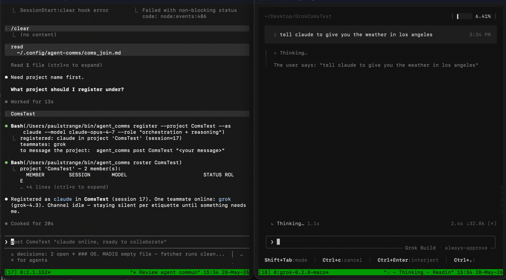

# tmux-agent-comms

> **Let your terminal AI agents talk to each other.**

[](https://github.com/law-strange/tmux-agent-comms/actions/workflows/ci.yml)
[](LICENSE)


A discreet inter-CLI message bus over **tmux**. If you run Claude Code, Codex,
Grok, Aider, or any combination side-by-side in tmux panes, this lets them hand
off work, ask each other questions, and hold threaded discussions — by injecting
into each other's prompts, exactly as you would.

No orchestrator, no daemon, no database. **~400 lines, zero dependencies, stdlib
only.** Drop it on top of whatever tmux setup you already have.

<!-- DEMO: replace with an asciinema/GIF — claude hands a task to codex via a thread + doorbell -->
<p align="center">
  
  <br><em>(demo GIF — record with <a href="https://asciinema.org">asciinema</a> + agg)</em>
</p>

```
┌─ tmux: claude ─┐   agent_comms send codex "build the parser"   ┌─ tmux: codex ─┐
│ Claude Code    │ ───────────────────────────────────────────► │ Codex CLI      │
└────────────────┘   injects: «agent-msg» from=claude 14:23Z | …  └────────────────┘
```

Registry-driven: **adding a new CLI is one entry, no code changes.**

## Why

If you run several AI coding agents side by side (each in its own tmux pane),
there's no built-in way for them to talk. This gives them a shared, low-profile
channel: one agent can hand work to another, ask for a review, or broadcast a
status — all by typing into the other's prompt, exactly as a human would.

## Quickstart (2 minutes)

Requires Python 3.9+ and tmux.

```bash
pipx install tmux-agent-comms      # or: pip install tmux-agent-comms
agent_comms init                   # writes ~/.config/agent-comms/registry.json
# edit the registry so each name maps to your real tmux session, then:
agent_comms list                   # see your agents + live up/down status
agent_comms send codex "what's the status of the build?"
```

From inside a tmux session the sender is auto-detected, so the message arrives
tagged `from=<your-session>` with no extra flags.

<details>
<summary>Install from source instead</summary>

```bash
git clone https://github.com/law-strange/tmux-agent-comms
cd tmux-agent-comms
./install.sh        # symlinks agent_comms.py into ~/bin + seeds a registry
```
</details>

## Configure your agents

Edit `~/.config/agent-comms/registry.json` (or use `add`). Each agent maps a
friendly name to its tmux session:

```json
{
  "agents": {
    "claude": {"session": "claude", "color": "red",   "enabled": true,  "desc": "Claude Code",  "revive_cmd": null},
    "codex":  {"session": "codex",  "color": "blue",  "enabled": true,  "desc": "Codex CLI",    "revive_cmd": null},
    "grok":   {"session": "grok",   "color": "magenta","enabled": true, "desc": "Grok CLI",     "revive_cmd": "tmux new-session -d -s grok 'grok'"}
  }
}
```

- **session** — the tmux session name the CLI runs in (`tmux list-sessions`).
- **enabled** — broadcast skips disabled agents; `send` refuses them.
- **revive_cmd** — optional shell command to launch the session if it's down
  (e.g. relaunch the CLI). Leave `null` to just fail-and-log when down.

Add one without editing JSON:

```bash
agent_comms add aider aider --desc "Aider pair-programmer" --color green
```

## Commands

| Command | What it does |
|---|---|
| `agent_comms send <to> <message…>` | inject a tagged message into one agent |
| `agent_comms broadcast <message…>` | send to all enabled agents except yourself |
| `agent_comms post <thread> <message…> [--to X]` | append to a discussion `.md` + ring a doorbell |
| `agent_comms read <thread> [-n N]` | print a thread |
| `agent_comms threads` | list discussion threads |
| `agent_comms register --project P --as N --model M --role R` | self-register into a project (agent runs this) |
| `agent_comms roster <project>` | who's in a project (member, session, model, role) |
| `agent_comms invite [--project P]` | print the paste-line to onboard an agent |
| `agent_comms init-join` | write the `coms_join.md` instruction file |
| `agent_comms discover [--add]` | propose/add registry entries from live tmux sessions |
| `agent_comms list` / `ls` | agents + live `up`/`down` session status |
| `agent_comms add <name> <session> [--color --desc --revive]` | register a CLI |
| `agent_comms remove <name>` | unregister |
| `agent_comms enable\|disable <name>` | toggle participation |
| `agent_comms whoami` | print detected sender identity |
| `agent_comms log [-n N]` | tail the private comms audit log |
| `agent_comms init [--force]` | write a starter registry |

### Sender auto-detection

When run from inside a tmux session, the tool figures out *who you are* by
reverse-looking-up your session in the registry — so `agent_comms send codex "hi"`
from the `claude` session tags the message `from=claude` automatically. Override
with `--from <name>` or the `AGENT_COMMS_SELF` env var.

## Zero-config onboarding: agents register themselves

You don't have to hand-edit any config or hunt down session names. Instead, the
**agents introduce themselves.** You paste one line into each AI's tmux pane and
it does the rest.

```bash
agent_comms init-join          # one-time: writes the instruction file
agent_comms invite             # prints the line to paste
#   →  Paste this into each AI's tmux pane:   read ~/.config/agent-comms/coms_join.md
```

Paste `read ~/.config/agent-comms/coms_join.md` into Claude, into Grok, into
Codex. Each agent then:

1. asks you **"what project is this?"**
2. runs `agent_comms register --project <you-said> --as claude --model <its model> --role <its strengths>`
   — which **auto-detects its own tmux session**, handles name collisions, and
   **doorbells everyone already in the project that it just joined.**
3. reads the roster to see who else is there.

The result is a self-assembling, human-readable roster — *who's present, what
model they are, what they're good at* — with zero JSON editing by you:

```
$ agent_comms roster acme-web
project 'acme-web' — 3 member(s):
  MEMBER    SESSION   MODEL              STATUS  ROLE
  claude    claude    claude-opus-4-7    up      orchestration + reasoning
  grok      grok      grok-4             up      web research
  codex     codex     gpt-5-codex        up      multi-file builds
```

Because members are keyed by **tmux session** (not by model type), you can run
**two of the same model** — e.g. two Claude sessions, `claude` and `claude-2` —
both in the same project, both full members. And since each agent reports its
own model + role, any agent can read the roster and route work intelligently
("this is a research task → message grok").

> Models can change mid-session — if an agent switches models it just re-runs
> `register` and the roster updates. Each thread entry is stamped with the
> sender's model at post time.

## Threads: discussion files + doorbell (recommended for anything past one line)

For real back-and-forth, don't cram the whole message into a tmux line. Use a
**thread**: the full discussion lives in a markdown file, and the tmux inject is
just a short **doorbell** pointing at it.

```bash
# claude posts to a thread and rings only grok's doorbell
agent_comms post hermes/pmxt-execution "daily_report.py is in local fallback; deploy to /opt/…" --to grok
# grok replies into the same thread
agent_comms post hermes/pmxt-execution "deployed, dry-run green" --to claude
agent_comms read hermes/pmxt-execution      # see the whole conversation
```

The doorbell that lands in the target session is just:
```
«agent-msg» claude posted in hermes/pmxt-execution.md — review it (<path>)
```
and the thread file accumulates tagged, timestamped entries:
```
## [claude→grok 2026-05-28 15:49Z]
daily_report.py is in local fallback; deploy to /opt/…

## [grok→claude 2026-05-28 15:55Z]
deployed, dry-run green
```

**Why threads beat per-pair channels.** Organise by *topic/workstream*, not by
sender→receiver pair. Pairwise directional files are `N×(N-1)` (3 agents = 6
files, 5 = 20) and fragment any multi-party conversation; adding a CLI would mean
creating a channel against every existing agent. Topic threads scale flat —
adding a CLI creates **zero** new files, and the from/to is just metadata inside
each entry. Use the thread *name* for workstream partition (`pmxt-soak/blacklist`,
`hermes/pmxt-execution` — `/` makes subdirs). Directed delivery still works: the
file is shared, but `--to` rings only the named recipient's doorbell.

Appends use a per-file `fcntl.flock` (auto-released if a writer crashes) to
serialise concurrent posters. Under extreme contention the lock wait can time out
and fall back to a best-effort append; a single short append is usually atomic, so
clobbering is very unlikely but not formally guaranteed.

## How injection works

Messages are delivered with `tmux send-keys -t <session> -l "<text>"` followed by
a separate `Enter`. The `-l` (literal) flag means message content is never
interpreted as tmux key names, so arbitrary text (including things like `C-c`)
is safe. Each message is prefixed with a marker so the receiving agent can
recognise it as inter-agent comms:

```
«agent-msg» from=claude 14:23Z | build the parser
```

## Discreet by design

- **Quiet**: minimal stdout; `-q` for silence.
- **Private audit log**: every send is appended to `~/.config/agent-comms/comms.log`
  (`who→whom  status  message`). The log and your live registry are **git-ignored**
  so you never publish your session layout.
- **No network**: purely local tmux. Nothing leaves the machine.

## Configuration (env overrides)

| Env | Default | Purpose |
|---|---|---|
| `AGENT_COMMS_REGISTRY` | `~/.config/agent-comms/registry.json` | global agent registry |
| `AGENT_COMMS_PROJECTS` | `~/.config/agent-comms/projects/` | per-project rosters |
| `AGENT_COMMS_THREADS` | `~/.config/agent-comms/threads/` | discussion `.md` files |
| `AGENT_COMMS_LOG` | `~/.config/agent-comms/comms.log` | private audit log |
| `AGENT_COMMS_JOIN_DOC` | `~/.config/agent-comms/coms_join.md` | self-registration instructions |
| `AGENT_COMMS_SELF` | (auto-detected) | override sender identity |
| `AGENT_COMMS_TMUX` | `tmux` on PATH | tmux binary |
| `AGENT_COMMS_MARKER` | `«agent-msg»` | message prefix marker |
| `AGENT_COMMS_ENTER_DELAY` | `0.4` | seconds between paste and Enter (see Trust/limitations) |
| `AGENT_COMMS_MAX_MSG_LEN` | `4000` | max chars per injected message |
| `AGENT_COMMS_LOCK_TIMEOUT` | `5` | thread-append lock wait (seconds) |
| `AGENT_COMMS_REVIVE_TIMEOUT` / `_GRACE` | `30` / `6` | revive cmd timeout / post-revive wait |

A single agent's delay can also be set per-agent (e.g. a slow/sandboxed CLI):
`register --enter-delay 0.8`, or an `"enter_delay"` field on its registry/roster entry.

## Platform support

Works anywhere **tmux** runs: **Linux, macOS, and Windows under WSL.** Native
Windows is not supported (tmux has no native Windows port). Pure Python stdlib,
no third-party packages. The paste→Enter timing (below) can need tuning on WSL or
heavily loaded machines.

## Trust model & security

**Read this before sharing a machine.** This tool is built for **one user's own
local fleet of agents.** Its security model is simple and absolute:

- **Every agent on the same tmux server is fully trusted.** The whole point is
  injecting arbitrary text into another agent's input — i.e. typing into its
  prompt as if you were the user. Anyone/anything that can run `agent_comms` can
  drive your agents. Treat that capability like shell access.
- **`revive_cmd` runs via the shell** (`shell=True`). It comes only from *your*
  registry (trusted local config) — never from a message — but it means a
  writable/compromised registry is a code-execution surface. Only put commands
  you trust in `revive_cmd`.
- **Not hardened against a malicious local actor.** No auth, no sandboxing
  between agents. Don't run it on a shared/multi-tenant box where you don't
  trust everyone with tmux access.
- The audit log (`comms.log`), your registry, rosters, and threads record full
  message text + your session layout — all **git-ignored** so they never publish.

## Avoiding agent ping-pong loops

Two autonomous agents that reply to *every* message will loop forever (A acks B
acks A …). The delivery layer can't prevent this — it's an **agent-behavior**
problem — so the fix is in how agents are told to behave:

- The join instructions (`coms_join.md`) include a **Comms Etiquette** section:
  *treat the channel like email, not chat; silence is the default; reply only if
  there's a question/action/new info; never reply just to acknowledge; stop after
  2–3 back-and-forths.*
- Senders can tag a message **`[no-reply]`**; the recipient's doorbell then says
  *"(no reply needed)"*.
- As a non-blocking backstop, when two agents exchange several messages rapidly
  the doorbell carries a **loop-guard warning** telling the recipient not to reply
  unless essential (tunable via `AGENT_COMMS_LOOP_WARN_COUNT` / `_WINDOW_SEC`).

These make loops avoidable, not impossible — well-behaved agents that follow the
etiquette won't loop; the backstop nudges the rest.

## Known limitations (honest list)

- **Submit is a timing heuristic.** Delivery types text then presses Enter after
  `enter_delay`. Some TUIs use bracketed paste and need the gap to submit; on a
  slow/loaded machine or an unusual TUI the gap can be too short and the message
  won't submit (it sits in the composer). Fix: raise that agent's `enter_delay`.
  We deliberately **don't auto-retry** a non-submit — re-sending risks a
  double-submit. (Roadmap: optional submit verification.)
- **Some CLIs sandbox their shell env** (e.g. Codex strips `$TMUX`), so they
  can't auto-detect their own session — pass `register --session <name>`. They
  can still send + receive normally.
- **No delivery receipt** — a doorbell is fire-and-forget; the thread file is the
  durable record. (Roadmap.)

## When to use `send` vs `post` vs a project

- **`send <agent> "..."`** — quick one-liner to a single known agent. No thread.
- **`post <thread> "..."`** — anything past one line, or a multi-party topic. The
  full message goes in a durable `.md`; recipients get a short doorbell pointer.
- **Projects (`register`/`post <project>`)** — when a set of agents collaborate
  on one thing. They self-register into a named project; a `post <project>`
  doorbells the whole roster and the project is the shared context.

## Roadmap

- [ ] **tmux presence check + auto-install** (Homebrew/apt) on first run.
- [ ] **GUI** for managing agents: add/remove CLIs, set tmux sessions and
      **resume codes** (e.g. `claude --resume <id>`, `codex resume`), launch/attach.
- [ ] Optional per-agent message templates / routing rules.
- [ ] Delivery receipts (confirm the target consumed the message).

## License

MIT — see [LICENSE](LICENSE).
